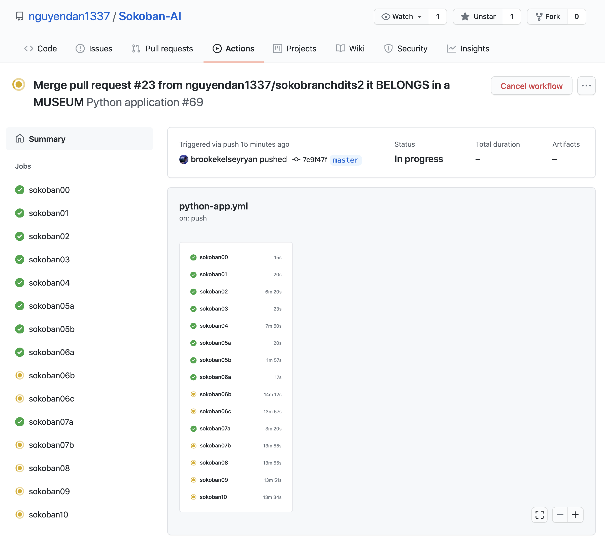

# Sokobandits, A Hybrid Q-Learning and BFS Approach to the Sokoban Game

Contributors: [Dan Nguyen](https://github.com/nguyendan1337), [Jillian Ness](https://github.com/jcness216), [Brooke Ryan](https://github.com/brookekelseyryan) 

Final project for CS 271, Introduction to Artificial Intelligence, UC Irvine Fall Quarter 2020.

Instructor: Professor Kalev Kask


# README

## To Run the Project

To run trials, there are a few options:

### Run Trials on Remote Server via GitHub Actions

This option should be followed if you would prefer to run trials on a remote server instead of your own machine.

In our project's GitHub repository, trials are configured to run every time a pull request is posted to the branch.  

1. Follow [these steps](https://docs.github.com/en/free-pro-team@latest/github/collaborating-with-issues-and-pull-requests/creating-a-pull-request) to create a pull request for the project [Sokoban-AI](https://github.com/nguyendan1337/Sokoban-AI).

2. Once you have a pull request posted to the project, navigate to the project's [Actions](https://github.com/nguyendan1337/Sokoban-AI/actions).  On this page, you can see the history of all trial runs for the project.  Click on the workflow that corresponds to your pull request.
3. There, you can view a build job for each benchmark problem:



### Run Trials on Local Machine

If desired, trials can also be run on your local machine.  Please note, the project can currently find a solution only for benchmark problems 00 through 07a.  

1. Ensure you have Python >=3.8 set up on your machine. 

2. Navigate to the root directory of the project folder. (*This is so the dependencies step can utilize the setup.py script that specifies library dependencies*.) 

3. Install dependencies.

   ```
   python -m pip install --upgrade pip
   pip install .
   ```

4. Navigate to the testing directory.

   ```
   cd test/trials_no_logging/
   ```

5. Run trials.

   0. ```
      python -m unittest sokoban00.py
      ```

   1. ```
      python -m unittest sokoban01.py
      ```

   2. ```
      python -m unittest sokoban02.py
      ```

   3. ```
      python -m unittest sokoban03.py
      ```

   4. ```
      python -m unittest sokoban04.py
      ```

   5. ```
      python -m unittest sokoban05a.py
      ```

      ```
      python -m unittest sokoban05b.py
      ```

   6. ```
      python -m unittest sokoban06a.py
      ```

      ```
      python -m unittest sokoban06b.py
      ```

      ```
      python -m unittest sokoban06c.py
      ```

   7. ```
      python -m unittest sokoban07a.py
      ```

